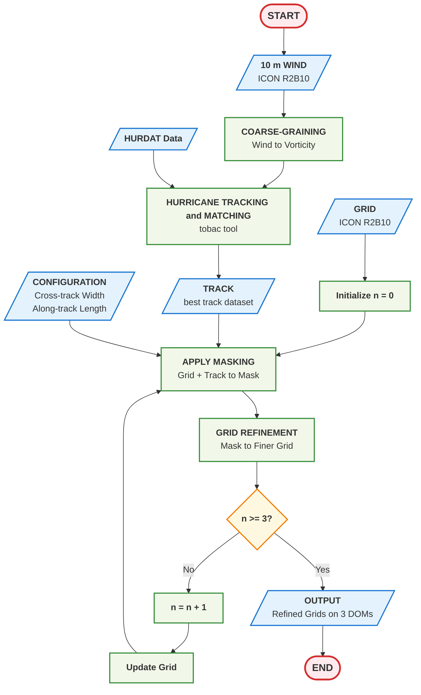

```mermaid
flowchart TD
    A([START]) 
    
    %% Initial inputs
    C1[/<b>GRID</b> <br/> ICON R2B10/]
    A --> C2[/<b>10 m WIND</b> <br/>ICON R2B10/]
    C3[/<b>HURDAT Data</b>/]
    
    %% Wind processing chain
    C2 --> D[<b>COARSE-GRAINING</b><br/>Wind to Vorticity]
    
    D --> F[<b>HURRICANE TRACKING and MATCHING</b><br/>tobac tool]
    
    C3 --> F
    F --> E1[/<b>TRACK</b><br/>best track dataset/]

    %% Configuration
    G[/<b>CONFIGURATION</b><br/>Cross-track Width<br/>Along-track Length/]
    
    %% Main refinement loop
    C1 --> B[<b>Initialize n = 0</b>]
    B --> H[<b>APPLY MASKING</b><br/>Grid + Track to Mask]
    E1 --> H
    G --> H
    
    H --> I[<b>GRID REFINEMENT</b><br/>Mask to Finer Grid]
    
    I --> K{<b>n >= 3?</b>}
    
    K -->|No| L[<b>n = n + 1</b>]
    L --> M[<b>Update Grid</b>]
    M --> H
    
    K -->|Yes| N[/<b>OUTPUT</b><br/>Refined Grids on 3 DOMs/]
    
    N --> O([END])
    
    %% Standard professional color scheme
    classDef inputOutput fill:#e3f2fd,stroke:#1976d2,stroke-width:2px,font-size:16px
    classDef process fill:#f1f8e9,stroke:#388e3c,stroke-width:2px,font-size:16px
    classDef decision fill:#fff8e1,stroke:#f57c00,stroke-width:2px,font-size:16px
    classDef startEnd fill:#ffebee,stroke:#d32f2f,stroke-width:3px,font-size:18px,font-weight:bold
    
    class C1,C2,C3,E1,G,N inputOutput
    class B,D,F,H,I,L,M process
    class K decision
    class A,O startEnd
```

