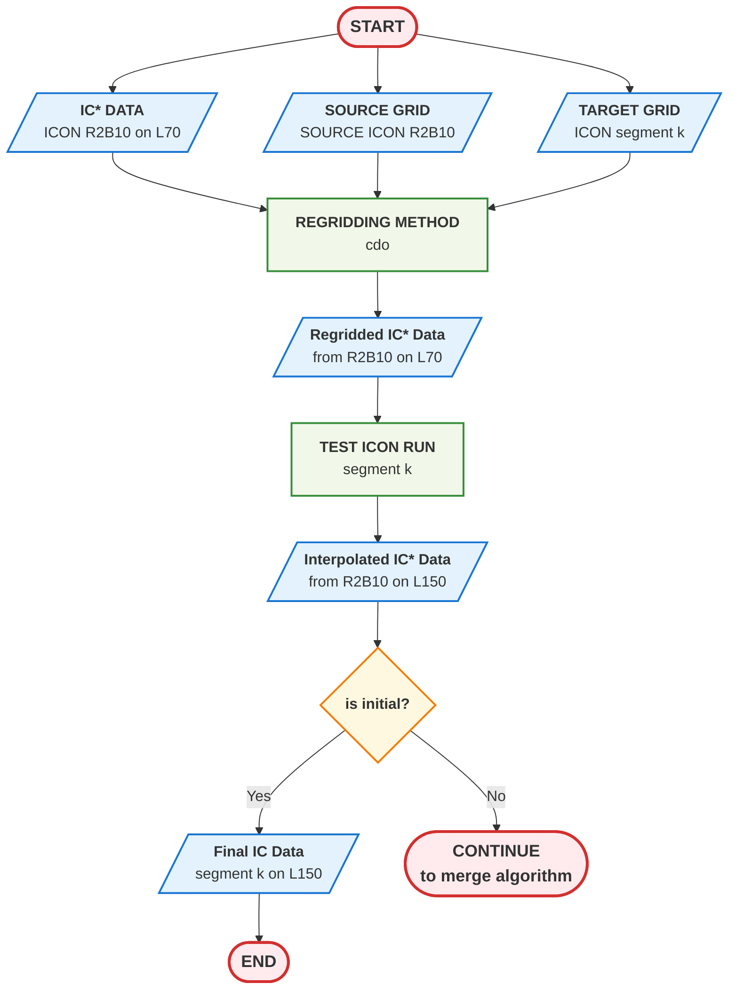

```mermaid
flowchart TD
    A([START])
    
    %% Input data
    A --> B[/<b>IC* DATA</b><br/>ICON R2B10 on L70/]
    A --> C[/<b>SOURCE GRID</b><br/>SOURCE ICON R2B10/]
    A --> D[/<b>TARGET GRID</b><br/>ICON segment k/]
    
    %% Main regridding process
    B --> E[<b>REGRIDDING METHOD</b><br/>cdo]
    C --> E
    D --> E
    
    %% Vertical interpolation
    E --> F[/<b>Regridded IC* Data</b><br/>from R2B10 on L70/]

    %% Height levels generation
    F --> H[<b>TEST ICON RUN</b><br/>segment k]
        

    %% Weighted merging
    H --> K[/<b>Interpolated IC* Data</b><br/>from R2B10 on L150/]

    K --> K1{<b>is initial?</b>}
    K1 --> |Yes|P[/<b>Final IC Data</b><br/>segment k on L150/]
    K1 --> |No|X([<b>CONTINUE</b><br/>to merge algorithm])
    
    P --> Q([END])

    


    %% Professional color scheme - original colors until F
    classDef inputOutput fill:#e3f2fd,stroke:#1976d2,stroke-width:2px,font-size:16px
    classDef process fill:#f1f8e9,stroke:#388e3c,stroke-width:2px,font-size:16px
    classDef decision fill:#fff8e1,stroke:#f57c00,stroke-width:2px,font-size:16px
    classDef startEnd fill:#ffebee,stroke:#d32f2f,stroke-width:3px,font-size:18px,font-weight:bold
    
    %% Orange borders for processes after regridded IC on L70
    classDef orangeBorder fill:#e3f2fd,stroke:#ff8c00,stroke-width:3px,font-size:16px
    classDef orangeBorderProcess fill:#f1f8e9,stroke:#ff8c00,stroke-width:3px,font-size:16px
    
    class B,C,D,F,K,P inputOutput
    class E,H process
    class T,K1 decision
    class A,Q,X startEnd
    class I,M1,N orangeBorder
    class J,M,M2,O orangeBorderProcess
```

