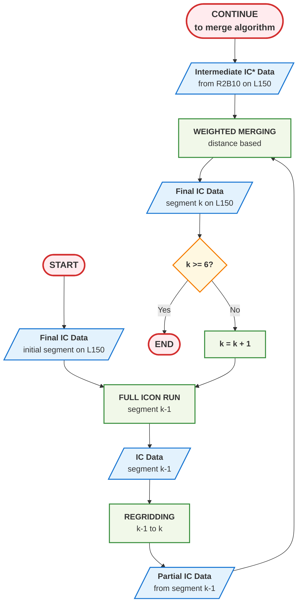

```mermaid
flowchart TD
    A([<b>CONTINUE</b><br/>to merge algorithm])
    
       
    %% Previous segment data workflow
    A2([START])

    A2 --> R[/<b>Final IC Data</b><br/>initial segment on L150/]
    R --> M[<b>FULL ICON RUN</b><br/>segment k-1]
    M --> M1[/<b>IC Data</b><br/>segment k-1/]
    M1 --> M2[<b>REGRIDDING</b><br/>k-1 to k]
    M2 --> N[/<b>Partial IC Data</b><br/>from segment k-1/]
    
    
    %% Weighted merging
    A --> K[/<b>Intermediate IC* Data</b><br/>from R2B10 on L150/]
    K --> O[<b>WEIGHTED MERGING</b><br/>distance based]
    N --> O
    
    %% Final output
    O --> P[/<b>Final IC Data</b><br/>segment k on L150/]
    

    P --> B{<b>k >= 6?</b>}
    B -->|Yes| Q([END])    
    B -->|No| C[<b>k = k + 1</b>]
    C --> M
    

    
    %% Professional color scheme - original colors until F
    classDef inputOutput fill:#e3f2fd,stroke:#1976d2,stroke-width:2px,font-size:16px
    classDef process fill:#f1f8e9,stroke:#388e3c,stroke-width:2px,font-size:16px
    classDef decision fill:#fff8e1,stroke:#f57c00,stroke-width:2px,font-size:16px
    classDef startEnd fill:#ffebee,stroke:#d32f2f,stroke-width:3px,font-size:18px,font-weight:bold
    

    
    class F,I,K,M1,N,P,R inputOutput
    class C,D,E,H,J,M,M2,O process
    class B decision
    class A,A2,Q startEnd
```

